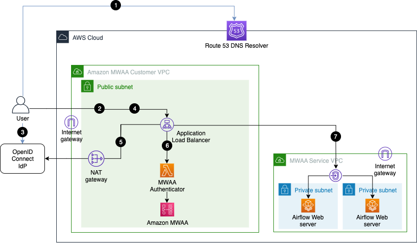

# Application load balancer single-sign-on for Amazon MWAA

## Overview

This is the accompanying solution to the AWS blogpost "[Automating secure access to multiple Amazon MWAA environments using existing OpenID Connect (OIDC) single-sign-on (SSO) authentication and authorization](https://aws.amazon.com/blogs/big-data/automate-secure-access-to-amazon-mwaa-environments-using-existing-openid-connect-single-sign-on-authentication-and-authorization/)"

This solution enables OpenID Connect (OIDC) single-sign-on (SSO) authentication and authorization for accessing [Apache Airflow](https://airflow.apache.org/docs/apache-airflow/stable/index.html) UI across multiple existing [Amazon Managed Workflows for Apache Airflow (MWAA)](https://aws.amazon.com/managed-workflows-for-apache-airflow/) Environments. 

Although not required, this solution can also be used to provision new Amazon MWAA Environments with either `PUBLIC_ONLY` and  `PRIVATE_ONLY` access modes. The new environments provisioned through this solution would be created with the OpenID Connect (OIDC) single-sign-on (SSO) authentication and authorization integration built-in. 

In the following sections, we first describe the applicable use cases, followed by the comprehensive [solution architecture](#solution-architecture) and instructions to implement for each of those use cases. Additionally, there is [system](#system-perspective) and [user](#user-perspective) perspectives for understanding the comprehensive solution, [prerequisites](#prerequisites), and [step-by-step tutorial](#step-by-step-tutorial) for deploying and using the detailed solution.

## Solution architecture
The solution provisions AWS resources for two distinct patterns required for the specific usecases:
<ol type="a">
  <li>To provision resources required to provide integration to single existing Amazon MWAA environment as mentioned in the QuickStart section.</li>
  <li>To provision resources required for all other usecases: Integrate to multiple existing Amazon MWAA environments or create one or more new Amazon MWAA environments</li>
</ol>

### Architecture for Quickstart
The solution architecture diagram with numbered call flow sequence to integrate with an existing Amazon MWAA environment with Public Access mode is shown below:


1. User-agent resolves ALB DNS domain name from DNS resolver. 
2. User-agent sends login request to the ALB path `/aws_mwaa/aws-console-sso`.
3. ALB redirects the user-agent to the OIDC identity provider (Idp) authentication endpoint, and the user-agent authenticates with the OIDC Idp.
4. If user authentication is successful, the OIDC Idp redirects the user-agent to the configured ALB `redirect_url` with authorization `code` included in the redirect URL.
5. ALB uses the authorization `code` to get `access_token` and OpenID JWT token with `"openid email"` scope from the OIDC Idp, and forwards the login request to the Amazon MWAA Authenticator Lambda target with the JWT token included in the request header `x-amzn-oidc-data`.
6.  Amazon MWAA Authenticator Lambda verifies the JWT token in the request header using ALB public keys, and uses the configured fixed `rbac_role` to login to the requested `mwaa_env` environment. Quick start option does not perform any user authorization for the configured `rbac_role`.
7. Amazon MWAA Authenticator Lambda routes the user-agent to the Apache Airflow console in the requested Amazon MWAA Environment with login token through the ALB.

### Architecture for Other use cases:
The solution architecture diagram with numbered call flow sequence for internet network reachability is shown below:


The solution architecture diagram for AWS Client VPN network reachability is shown below:


The central component of the solution architecture is an [Application Load Balancer (ALB)](https://aws.amazon.com/elasticloadbalancing/application-load-balancer/) setup with a fully-qualified domain name (FQDN) and public (internet), or private access. The ALB provides SSO access to one or more Amazon MWAA Environments. 

The user-agent (web browser) call flow for accessing an Apache Airflow console in the target Amazon MWAA environment is as follows:

1. User-agent resolves ALB DNS domain name from DNS resolver. 
2. User-agent sends login request to the ALB path `/aws_mwaa/aws-console-sso` with the target Amazon MWAA Environment and the [Apache Airflow role based access control (RBAC) role](https://airflow.apache.org/docs/apache-airflow/stable/administration-and-deployment/security/access-control.html) in the query parameters `mwaa_env` and `rbac_role`, respectively.
3. ALB redirects the user-agent to the OIDC identity provider (Idp) authentication endpoint, and the user-agent authenticates with the OIDC Idp.
4. If user authentication is successful, the OIDC Idp redirects the user-agent to the configured ALB `redirect_url` with authorization `code` included in the redirect URL.
5. ALB uses the authorization `code` to get `access_token` and OpenID JWT token with `"openid email"` scope from the OIDC Idp, and forwards the login request to the Amazon MWAA Authenticator Lambda target with the JWT token included in the request header `x-amzn-oidc-data`.
6.  Amazon MWAA Authenticator Lambda verifies the JWT token in the request header using ALB public keys, and [authorizes](#add-authorization-records-to-dynamodb-table) the authenticated user for the requested `mwaa_env` and `rbac_role` using a DynamoDB table. The use of DynamoDB for authorization is optional, and the [Lambda code](cdk/mwaa_authx_lambda_code/mwaa_authx.py) function `is_allowed` can be adapted to use other authorization mechanisms.
7. Amazon MWAA Authenticator Lambda redirects the user-agent to the Apache Airflow console in the requested Amazon MWAA Environment with `login` token included in the `redirect` URL.

This solution architecture assumes that the user-agent has network reachability to the AWS Application Load Balancer and Apache Airflow console endpoints used in this solution. If the endpoints are public, then reachability is over the internet, otherwise, the network reachability is assumed via an [AWS Direct Connect](https://aws.amazon.com/directconnect/), or [AWS Client VPN](https://docs.aws.amazon.com/vpn/latest/clientvpn-admin/what-is.html).

**NOTE: This solution does not setup up AWS Client VPN.**

## Applicable Use cases

Use this solution for the following purposes: 

| Purpose | Description | Sectional Reference |
|---------|-------------|--------------------|
|Integrate to a single existing Amazon MWAA environment|  If you are integrating with a single existing Amazon MWAA environment, follow the guides in the Quickstart section. The Quickstart requires that you specify the same ALB VPC as that of your existing Amazon MWAA VPC. You can specify the default Apache Airflow RBAC role that all users will assume. The ALB with an HTTPS listener is configured within your existing Amazon MWAA VPC.| [Quick start](#quick-start) |
|Integrate to multiple existing Amazon MWAA environments| For connecting to multiple existing Amazon MWAA environments that are already provisioned (either with Public or Private access modes) in your AWS accounts. The setup process will create a new VPC with subnets hosting the ALB and the HTTPS listener. You must define the CIDR range for this ALB VPC such that it does not overlap with the VPC CIDR range of your existing Amazon MWAA VPCs. You can specify the default Apache Airflow RBAC role that all users will assume.| [Integrate to multiple existing Amazon MWAA environments](#integrate-to-multiple-existing-amazon-mwaa-environments)|
| Create a single new Amazon MWAA environment with built-in integration | For creating a new Amazon MWAA environment, either with Public or Private access mode with in-built OIDC integration. The setup process will create an ALB VPC, an ALB with an HTTPS listener, an AWS Lambda Authorizer, an Amazon DynamoDB table, the respective Amazon MWAA VPCs and an Amazon MWAA environment in them. Further, it creates the VPC peering connection between the ALB VPC and the Amazon MWAA VPC. | [Create a new Amazon MWAA environment](#create-a-new-amazon-mwaa-environment) |
| Create multiple new Amazon MWAA environments with built-in integration| For creating multiple new Amazon MWAA environments, either with Public or Private access mode with in-built OIDC integration for each of them. The setup process will create an ALB VPC, an ALB with an HTTPS listener, an AWS Lambda Authorizer, an Amazon DynamoDB table, the respective Amazon MWAA VPCs and multiple Amazon MWAA environments in them. Further, it creates the VPC peering connection between the ALB VPC and the Amazon MWAA VPC.| [Create multiple new Amazon MWAA environments](#create-multiple-new-amazon-mwaa-environments) |


## Quick start

If you need to use an [Application Load Balancer (ALB)](https://aws.amazon.com/elasticloadbalancing/application-load-balancer/) to provide OIDC based SSO to a *single exsiting* Amazon MWAA environment with uniform [Apache Airflow RBAC](https://airflow.apache.org/docs/apache-airflow/stable/administration-and-deployment/security/access-control.html) role access, you only need to complete the steps described below in the [Quick start](#quick-start) section. Under this option, all HTTPS traffic between your browser and the Amazon MWAA UI console flows through the ALB, and all ALB SSO authenticated users have uniform  access to the single Amazon MWAA environment.

### Setup

Complete the [prerequisites](#prerequisites), and run following command:

    source setup-venv.sh 

Complete `Oidc` and `Alb` contexts in [cdk.context.json](cdk/cdk.context.json). The `Oidc` context specifies the configuration of your OIDC Idp. For example, for [Okta OIDC Idp](https://developer.okta.com/signup/), the configuration would be similar to shown below:

    "Oidc": {
        "ClientId": "...",
        "ClientSecretArn": "...",
        "Issuer": "https://xxx.okta.com/oauth2/default",
        "AuthorizationEndpoint":"https://xxx.okta.com/oauth2/default/v1/authorize",
        "TokenEndpoint":"https://xxx.okta.com/oauth2/default/v1/token",
        "UserInfoEndpoint":"https://xxx.okta.com/oauth2/default/v1/userinfo"
    }

The ALB may be internet facing, or private. By default, the **ALB is private**. Set `InternetFacing` to `true` below for internet facing ALB:

    "Alb": {
        "InternetFacing": false,
        "SessionCookieName": "AWSELBAuthSessionCookie",
        "LogBucketArn": "...",
        "LogBucketPrefix": "customer-alb",
        "CertificateArn": "..."
    }

Complete `QuickStart` in  [cdk.context.json](cdk/cdk.context.json) using information obtained from your *existing* MWAA environment. You must specify at least two subnets in two different AWS availability zones in the `SubnetIds` below. To specify the  `MwaaEndpointIps` below, find the Amazon MWAA endpoint IPs using [AWS console or CLI](https://docs.aws.amazon.com/mwaa/latest/userguide/vpc-vpe-access.html#vpc-vpe-hosts). Valid values for `RbacRoleName` are  `Admin`, `User`, `Viewer`, `Op`, and `Public`.

    "QuickStart": {
        "VpcId": "...",
        "SubnetIds": [],
        "SecurityGroupId": "...",
        "MwaaEnvironmentName": "...",
        "RbacRoleName": "Admin",
        "MwaaEndpointIps": []
    }

Run following commands:

    cdk deploy QuickStartAlb


## Integrate to multiple existing Amazon MWAA environments

If you need to use an [Application Load Balancer (ALB)](https://aws.amazon.com/elasticloadbalancing/application-load-balancer/) to provide OIDC based SSO to *multiple exsiting* MWAA environment with uniform [Apache Airflow RBAC](https://airflow.apache.org/docs/apache-airflow/stable/administration-and-deployment/security/access-control.html) role access, you only need to complete the steps described below in this section. Under this option, all HTTPS traffic from your browser to the Amazon MWAA UI console flows directly, following successful OIDC based SSO.

### Setup
Complete the [prerequisites](#prerequisites), and run following command:

    source setup-venv.sh

For connecting to multiple existing Amazon MWAA environments, specify only the Amazon MWAA environment name in the JSON [cdk.context.json](cdk/cdk.context.json) file. Complete `Oidc`, `Alb` and `CustomerVpc`  contexts and mention the Amazon MWAA environment names only in the `MwaaEnvironments` context. The setup process will create a new VPC with subnets hosting the ALB and the listener as defined by your `CustomerVpc` section configurations. You must define the CIDR range for this ALB VPC such that it does not overlap with the VPC CIDR range of your existing Amazon MWAA VPCs. 

Example to integrate with two existing Amazon MWAA environments names "Env1" and "Env2":

    "MwaaEnvironments": [
        {
        "Name": "Env1"
        },
        {
        "Name": "Env2"
        }
    ]

The `Oidc` context specifies the configuration of your OIDC Idp. For example, for [Okta OIDC Idp](https://developer.okta.com/signup/), the configuration would be similar to shown below:

    "Oidc": {
        "ClientId": "...",
        "ClientSecretArn": "...",
        "Issuer": "https://xxx.okta.com/oauth2/default",
        "AuthorizationEndpoint":"https://xxx.okta.com/oauth2/default/v1/authorize",
        "TokenEndpoint":"https://xxx.okta.com/oauth2/default/v1/token",
        "UserInfoEndpoint":"https://xxx.okta.com/oauth2/default/v1/userinfo"
    }    

The ALB may be internet facing, or private. By default, the **ALB is private**. Set `InternetFacing` to `true` below for internet facing ALB:

    "Alb": {
        "InternetFacing": false,
        "SessionCookieName": "AWSELBAuthSessionCookie",
        "LogBucketArn": "...",
        "LogBucketPrefix": "customer-alb",
        "CertificateArn": "..."
    }

Run following commands:

    cdk bootstrap
    cdk deploy CustomerVpc
    cdk deploy MwaaAuthxLambda
    cdk deploy CustomerAlb

Once the setup steps are complete, implement the [Post deployment configuration steps](#post-deployment-configuration). This includes adding the ALB CNAME record to the Amazon Route 53 DNS domain. 

For integrating with existing Amazon MWAA environments configured using private access mode there are additional steps that need to be configured. These include configuring VPC peering and subnet routes between the new ALB VPC and the existing Amazon MWAA VPC. Additionally, you will need to configure network connectivity from your user-agent to the private ALB endpoint resolved by your DNS domain.

### Additional Details: 
Visit the [Step-by-step tutorial](#step-by-step-tutorial) section for details on the CDK stack that this solution uses.

## Create a new Amazon MWAA environment

If you need to use an [Application Load Balancer (ALB)](https://aws.amazon.com/elasticloadbalancing/application-load-balancer/) to provide OIDC based SSO to a *single new* Amazon MWAA environment with uniform [Apache Airflow RBAC](https://airflow.apache.org/docs/apache-airflow/stable/administration-and-deployment/security/access-control.html) role access, you only need to complete the steps described below in this section. Under this option, all HTTPS traffic from your browser to the Amazon MWAA UI console flows directly, following successful OIDC based SSO.

### Setup
Complete the [prerequisites](#prerequisites), and run following command:

    source setup-venv.sh

For creating a new Amazon MWAA environments, specify the Amazon MWAA environment configurations in the JSON [cdk.context.json](cdk/cdk.context.json) file. Additionally, complete `Oidc`, `Alb` and `CustomerVpc` contexts. The setup process will create a new VPC with subnets hosting the ALB and the HTTPS listener as defined by your `CustomerVpc` section configurations. It will also create a new VPC for your new Amazon MWAA environment in it. Finally it will create the VPC peering connections between the ALB VPC and the Amazon MWAA VPC. 

You can define the `WebServerAccessMode` to be either `PUBLIC_ONLY` or `PRIVATE_ONLY`. You must define the CIDR range for this ALB VPC such that it does not overlap with the VPC CIDR range of your Amazon MWAA VPCs if the new Amazon MWAA environment is being created with PRIVATE_ONLY access. This is because for this solution to work, we need to establish VPC peering connection and subnet routes between the CustomerVpc and the VPC of the new Amazon MWAA Environment with PRIVATE_ONLY access.

The `Oidc` context specifies the configuration of your OIDC Idp. For example, for [Okta OIDC Idp](https://developer.okta.com/signup/), the configuration would be similar to shown below:

    "Oidc": {
        "ClientId": "...",
        "ClientSecretArn": "...",
        "Issuer": "https://xxx.okta.com/oauth2/default",
        "AuthorizationEndpoint":"https://xxx.okta.com/oauth2/default/v1/authorize",
        "TokenEndpoint":"https://xxx.okta.com/oauth2/default/v1/token",
        "UserInfoEndpoint":"https://xxx.okta.com/oauth2/default/v1/userinfo"
    }    

The ALB may be internet facing, or private. By default, the **ALB is private**. Set `InternetFacing` to `true` below for internet facing ALB:

    "Alb": {
        "InternetFacing": false,
        "SessionCookieName": "AWSELBAuthSessionCookie",
        "LogBucketArn": "...",
        "LogBucketPrefix": "customer-alb",
        "CertificateArn": "..."
    }

Define one Amazon MWAA configurations along with its VPC details as defined by the `VpcCIDR`, `MaxAZs`, `NatGateways`, `PublicSubnetMask` and `PrivateSubnetMask` fields.

Example to create a new large, public Amazon MWAA environment named "Env1":

    "MwaaEnvironments": [
        {
            "Name": "Env1",
            "EnvironmentClass": "mw1.large",
            "SourceBucketArn": "...",
            "DagsS3Path": "dags",
            "RequirementsS3Path": "mwaa/requirements-mwaa.txt",
            "RequirementsS3ObjectVersion": "...",
            "MinWorkers": 2,
            "MaxWorkers": 16,
            "Schedulers": 2,
            "DagProcessingLogsLevel": "INFO",
            "SchedulerLogsLevel": "INFO",
            "TaskLogsLevel": "INFO",
            "WorkerLogsLevel": "INFO",
            "WebserverLogsLevel": "INFO",
            "WebServerAccessMode": "PUBLIC_ONLY", 
            "ConfigurationOptions": {
                "core.dag_run_conf_overrides_params": "True"
            },
            "AWSServiceRoleForAutoScalingArn": "...",
            "VpcCIDR": "172.30.0.0/16",
            "MaxAZs": 2,
            "NatGateways": 1,
            "PublicSubnetMask": 24,
            "PrivateSubnetMask": 18
        }]

Run following commands, replacing `Env1` below in commands with the name of your Mwaa Environment:

    cdk bootstrap
    cdk deploy CustomerVpc
    cdk deploy MwaaVpcEnv1
    cdk deploy MwaaAuthxLambda
    cdk deploy MwaaEnvironmentEnv1
    cdk deploy CustomerAlb

Once the setup steps are complete, implement the [Post deployment configuration steps](#post-deployment-configuration). This includes adding the ALB CNAME record to the Amazon Route 53 DNS domain. 

### Additional Details: 
Visit the [Step-by-step tutorial](#step-by-step-tutorial) section for details on the CDK stack that this solution uses.

## Create multiple new Amazon MWAA environments

If you need to use an [Application Load Balancer (ALB)](https://aws.amazon.com/elasticloadbalancing/application-load-balancer/) to provide OIDC based SSO to a *multiple new* Amazon MWAA environment with uniform [Apache Airflow RBAC](https://airflow.apache.org/docs/apache-airflow/stable/administration-and-deployment/security/access-control.html) role access, you only need to complete the steps described below in this section. Under this option, all HTTPS traffic from your browser to the Amazon MWAA UI console flows directly, following successful OIDC based SSO.

### Setup
Complete the [prerequisites](#prerequisites), and run following command:

    source setup-venv.sh

Follow the instruction steps for [Create a new Amazon MWAA environment](#create-a-new-amazon-mwaa-environment) except one deviation: Instead of specifying one Amazon MWAA environment configuration in the `MwaaEnvironments` section of the JSON [cdk.context.json](cdk/cdk.context.json) file, append multiple Amazon MWAA definitions.

Example to create two new large Amazon MWAA environment named "Env1" and "Env2":

    "MwaaEnvironments": [
        {
            "Name": "Env1",
            "EnvironmentClass": "mw1.large",
            "SourceBucketArn": "...",
            "DagsS3Path": "dags",
            "RequirementsS3Path": "mwaa/requirements-mwaa.txt",
            "RequirementsS3ObjectVersion": "...",
            "MinWorkers": 2,
            "MaxWorkers": 16,
            "Schedulers": 2,
            "DagProcessingLogsLevel": "INFO",
            "SchedulerLogsLevel": "INFO",
            "TaskLogsLevel": "INFO",
            "WorkerLogsLevel": "INFO",
            "WebserverLogsLevel": "INFO",
            "WebServerAccessMode": "PUBLIC_ONLY",
            "ConfigurationOptions": {
                "core.dag_run_conf_overrides_params": "True"
            },
            ...
        },
        {
            "Name": "Env2",
            "EnvironmentClass": "mw1.large",
            "SourceBucketArn": "...",
            "DagsS3Path": "dags",
            "RequirementsS3Path": "mwaa/requirements-mwaa.txt",
            "RequirementsS3ObjectVersion": "...",
            "MinWorkers": 2,
            "MaxWorkers": 16,
            "Schedulers": 2,
            "DagProcessingLogsLevel": "INFO",
            "SchedulerLogsLevel": "INFO",
            "TaskLogsLevel": "INFO",
            "WorkerLogsLevel": "INFO",
            "WebserverLogsLevel": "INFO",
            "WebServerAccessMode": "PRIVATE_ONLY",
            "ConfigurationOptions": {
                "core.dag_run_conf_overrides_params": "True"
            },
            ...
        }
    ]

Run following commands, replacing `Env1` and `Env2` below in commands with the name of your Mwaa Environment:

    cdk bootstrap
    cdk deploy CustomerVpc
    cdk deploy MwaaVpcEnv1
    cdk deploy MwaaVpcEnv2
    cdk deploy MwaaAuthxLambda
    cdk deploy MwaaEnvironmentEnv1
    cdk deploy MwaaEnvironmentEnv2
    cdk deploy CustomerAlb

### Additional Details: 
Visit the [Step-by-step tutorial](#step-by-step-tutorial) section for details on the CDK stack that this solution uses.

## System perspective
The system perspective is useful for building and deploying this solution. This solution comprises of three core CloudFormation stacks defined using AWS CDK: 

* CustomerVpc
* MwaaAuthxLambda
* CustomerAlb

Besides the core stacks, this solution supports building Amazon MWAA Environment stacks. For each Amazon MWAA Environment you want to use in this solution, you must add a dictionary entry in the  `MwaaEnvironments` array in [cdk.context.json](cdk/cdk.context.json). If the array entry contains *only* the `Name` key, this solution assumes such an Amazon MWAA Environment is being managed outside this solution, otherwise, two *logical stacks per Amazon MWAA Environment* are created in this solution:

* MwaaVpc
* MwaaEnvironment

The [cdk.context.json](cdk/cdk.context.json) file included in this project is configured to create two new Amazon MWAA Environments: `Env1` with `PUBLIC_ONLY` access, and `Env2` with `PRIVATE_ONLY` access, which means following CloudFormation stacks are defined in this solution, in addition to the core stacks:

* MwaaVpcEnv1
* MwaaEnvironmentEnv1
* MwaaVpcEnv2
* MwaaEnvironmentEnv2

## User perspective

The user perspective is useful for understanding how to access a targe Amazon MWAA Environment assuming a specific Airflow RBAC role.

### Amazon MWAA Airflow console login and logout

For `login` into Apache Airflow console in the target Amazon MWAA Environment assuming a specific Apache Airflow RBAC role, we use following URL:

```
https://FQDN/aws_mwaa/aws-console-sso?mwaa_env=<MWAA-Environment-Name>&rbac_role=<Rbac-role-name>
```

For logout from an Apache Airflow console, we use the normal console logout. 

### SSO Logout

For SSO logout from ALB, we use following URL:

```
https://FQDN/logout
```

## Prerequisites

Before we can deploy this solution, we need to complete following prerequisites:

1. [AWS account access](#aws-account-access)
2. [CDK Build machine](#cdk-build-machine)
3. [DNS domain](#dns-domain)
4. [Fully-qualified-domain (FQDN) name](#fqdn-for-alb)
5. [SSL certificate](#ssl-certificate)
6. [Open Id connect (OIDC) identity provider](#oidc-idp)
7. [Service linked role for EC2 auto-scaling](#service-linked-role-for-ec2-auto-scaling)
8. [Amazon MWAA Environment source bucket](#mwaa-environment-source-bucket)
9. [Application load balancer (ALB) access logging bucket](#application-load-balancer-alb-access-logging-bucket)

### AWS account access

First, you need an AWS account. If needed, [create an AWS account](https://docs.aws.amazon.com/accounts/latest/reference/manage-acct-creating.html). This solution assumes you have [system administrator job function](https://docs.aws.amazon.com/IAM/latest/UserGuide/access_policies_job-functions.html) access to the AWS Management Console.

### CDK build machine

Next, you need a build machine. This solution uses [AWS CDK](https://aws.amazon.com/cdk/) to build the required stacks. You may use any machine with NodeJS, Python, [Docker](https://www.docker.com/) and [AWS CDK for Typescript](https://docs.aws.amazon.com/cdk/v2/guide/getting_started.html) installed as your build machine.  If you are new to AWS CDK, we recommend launching a fully-configured build machine in your target AWS region, as described below:

* Select your [AWS Region](https://docs.aws.amazon.com/AWSEC2/latest/UserGuide/using-regions-availability-zones.html). The AWS Regions supported by this solution include, us-east-1, us-east-2, us-west-2, eu-west-1, eu-central-1, ap-southeast-1, ap-southeast-2, ap-northeast-1, ap-northeast-2, and ap-south-1. 
* Subscribe to [Ubuntu Pro 22.04 LTS](https://aws.amazon.com/marketplace/pp/prodview-uy7jg4dds3qjw).
* If you do not already have an Amazon EC2 key pair, [create a new Amazon EC2 key pair](https://docs.aws.amazon.com/AWSEC2/latest/UserGuide/ec2-key-pairs.html#prepare-key-pair). You need the key pair name to specify the `KeyName` parameter when creating the AWS CloudFormation stack below. 
* Use the [public internet address](http://checkip.amazonaws.com/) of your laptop as the base value for the [CIDR](https://docs.aws.amazon.com/vpc/latest/userguide/VPC_SecurityGroups.html) to specify `SecurityGroupAccessCIDR` parameter in the CloudFormation template used below.  
* Using AWS Management console, create the build machine using [`cfn/ubuntu-developer-machine.yaml`](cfn/ubuntu-developer-machine.yaml) [AWS CloudFormation](https://docs.aws.amazon.com/AWSCloudFormation/latest/UserGuide/Welcome.html) template. This template creates [AWS Identity and Access Management (IAM)](https://aws.amazon.com/iam/) resources, so when you [create the CloudFormation Stack using the console](https://docs.aws.amazon.com/AWSCloudFormation/latest/UserGuide/cfn-console-create-stack.html), in the **Review** step, you must check 
**I acknowledge that AWS CloudFormation might create IAM resources.**  
* Once the stack status in CloudFormation console is `CREATE_COMPLETE`, find the EC2 instance launched in your stack in the Amazon EC2 console, and [connect to the instance using SSH](https://docs.aws.amazon.com/AWSEC2/latest/UserGuide/AccessingInstancesLinux.html) as user `ubuntu`, using your SSH key pair.
* When you connect to the instance using SSH, if you see the message `"Cloud init in progress."`, disconnect and try later after about 10 minutes. If you see the message `AWS developer machine is ready!`, your build machine is ready.

### DNS domain

Next, you need a DNS domain. You can use an existing DNS domain that you can administer, or create a new DNS domain using any DNS domain provider, e.g. [Amazon Route 53](https://aws.amazon.com/route53/).

### FQDN for ALB

As noted at the outset, the central component of this solution is an ALB. The ALB in this solution only supports HTTPS traffic. This means we need to create an [SSL certificate](#ssl-certificate), which requires us to first select a fully-qualified domain name (FQDN). For example, if your DNS domain is `example.com`, you may select a FQDN `alb-sso-mwaa.example.com`. 

You will need the FQDN for ALB while creating the [SSL Certificate](#ssl-certificate), and for [configuring a user-friendly alias](#post-deployment-configuration) for the ALB, once the ALB is created in the [step-by-step tutorial](#step-by-step-tutorial).

### SSL certificate

[Request an SSL certificate](https://docs.aws.amazon.com/acm/latest/userguide/gs-acm-request-public.html) for the FQDN selected above. Later, you will set the [Amazon Resource Name (ARN)](https://docs.aws.amazon.com/general/latest/gr/aws-arns-and-namespaces.html) of the SSL certificate in `Alb` CDK context variable `CertificateArn` in [cdk.context.json](cdk/cdk.context.json) while configuring the [ALB stack](#customeralb-stack) in the [step-by-step tutorial](#step-by-step-tutorial).

### OIDC Idp

This solution requires configuration of an application client in an OIDC Idp. You must configure the application client in your OIDC Idp with a Client Secret. 

You must create an [AWS Secrets Manager secret](https://docs.aws.amazon.com/secretsmanager/latest/userguide/create_secret.html) to store your Client Secret in plain-text format (not JSON). Later, you will set the secret's ARN in `Oidc` context variable `ClientSecretArn` in [cdk.context.json](cdk/cdk.context.json) while configuring the [ALB stack](#customeralb-stack) in the [step-by-step tutorial](#step-by-step-tutorial).

The OIDC Idp must support scope of `"openid email"`. The `redirect_url` and `logout_url` for your OIDC Idp must be set to `https://FQDN/oauth2/idpresponse` and `https://FQDN/logout`, respectively.

### Service linked role for EC2 auto scaling

[Create a service linked role for EC2 auto scaling](https://docs.aws.amazon.com/autoscaling/ec2/userguide/autoscaling-service-linked-role.html#create-service-linked-role). Later, you will set the ARN for this role in CDK context variable `AWSServiceRoleForAutoScalingArn` in [cdk.context.json](cdk/cdk.context.json) while configuring various VPC related stacks in the [step-by-step tutorial](#step-by-step-tutorial).

### MWAA Environment source bucket

If you plan to use this solution to automatically create Amazon MWAA Environments, create or use an existing Amazon S3 bucket with versioning enabled. Later, you will use the S3 bucket ARN in CDK context variable `SourceBucketArn` in various `MWAAEnvironments` array entries in [cdk.context.json](cdk/cdk.context.json) while configuring various Amazon MWAA Environment related stacks in the [step-by-step tutorial](#step-by-step-tutorial).

At this time, copy [requirements-mwaa.txt](cdk/requirements-mwaa.txt) to the `SourceBucketArn` bucket to the bucket path `mwaa/requirements-mwaa.txt`. Note the object version of the object you just copied and later use it in `RequirementsS3ObjectVersion` in various `MWAAEnvironments` array entries in [cdk.context.json](cdk/cdk.context.json) while configuring various Amazon MWAA Environment related stacks in the [step-by-step tutorial](#step-by-step-tutorial).

### Application load balancer (ALB) access logging bucket

Create or use an existing Amazon S3 bucket. Later you will use the S3 bucket ARN in `Alb`  CDK context variable `LogBucketArn` in [cdk.context.json](cdk/cdk.context.json) while configuring the [ALB stack](#customeralb-stack) in the [step-by-step tutorial](#step-by-step-tutorial). 

The access logging bucket must have [access logging bucket policy](https://docs.aws.amazon.com/elasticloadbalancing/latest/application/enable-access-logging.html#attach-bucket-policy) attached to it. An example access logging bucket policy for AWS Region `us-west-2` is shown below:

```
{
    "Version": "2012-10-17",
    "Statement": [
        {
            "Effect": "Allow",
            "Principal": {
                "AWS": "arn:aws:iam::797873946194:root"
            },
            "Action": "s3:PutObject",
            "Resource": "<your-s3-bucket-ARN>/customer-alb/AWSLogs/<your-AWS-account-id>/*"
        }
    ]
}
```

The `797873946194` above refers to the AWS account id for AWS load-balancing service running in `us-west-2`, and this value for other AWS regions can be found [here](https://docs.aws.amazon.com/elasticloadbalancing/latest/application/enable-access-logging.html#attach-bucket-policy).

## Step-by-step tutorial

To deploy the AWS CDK stacks in this solution, clone this github repository on your *build machine*. In the root directory of the cloned repository, execute [setup-venv.sh](setup-venv.sh) shell script.
    
Below we describe the steps required to deploy this solution.

### Configure CDK context

Below we describe how to configure the CDK context for following stacks:

1. [Customer VPC stack](#customervpc-stack)
2. [MwaaAuthxLambda stack](#mwaaauthxlambda-stack)
3. [MwaaVpc stack](#mwaavpc-stack)
4. [MwaaEnvironment stack](#mwaaenvironment-stack)
5. [CustomerAlb stack](#customeralb-stack)

#### CustomerVpc stack

The `CustomerVpc` stack creates a secure VPC with private and public subnets for running an Application Load Balancer (ALB) that provides the user access endpoint. 

The public subnets have direct access to the Internet. The private subnets have outbound access to the Internet via a NAT Gateway. VPC is connected to the relevant AWS services using VPC endpoints. VPC Flow Logs are enabled. 

An example `CustomerVpc` CDK context defined in [cdk.context.json](cdk/cdk.context.json) is shown below:

    "CustomerVpc": {
        "AWSServiceRoleForAutoScalingArn": "...",
        "VpcCIDR": "192.168.0.0/16",
        "MaxAZs": 2,
        "NatGateways": 1,
        "PublicSubnetMask": 24,
        "PrivateSubnetMask": 18
    }

You are free to change the `CustomerVpc` context, as needed. 

**NOTE:** The `VpcCIDR `of the `CustomerVpc` must not overlap with the VPC of any Amazon MWAA Environment with `PRIVATE_ONLY` access. This is because, for this solution to work, we need to establish VPC peering connection and subnet routes between the `CustomerVpc` and the VPC of an Amazon MWAA Environment with `PRIVATE_ONLY` access. 

If the Amazon MWAA VPC is created by this solution, the required VPC peering connection and subnet routes are automatically configured. If you are directly managing an Amazon MWAA Environment with `PRIVATE_ONLY` access and want to access such an Amazon MWAA Environment through this solution, you must create VPC peering connection and subnet routes between `CustomerVpc` and your Amazon MWAA VPC.

#### MwaaAuthxLambda stack

This stack deploys the Lambda function used for authorization. The authorization function enables access to the various Amazon MWAA Environments' Apache Airflow UI consoles. 

This stack creates an Amazon DynamoDB table used for mapping users and Amazon MWAA Environments to allowed [Apache Airflow RBAC roles](https://airflow.apache.org/docs/apache-airflow/stable/security/access-control.html).

The CDK `Alb` context variable `SessionCookieName` defined in [cdk.context.json](cdk/cdk.context.json) is used by this stack. 

#### MwaaVpc stack

The `MwaaVpc` stack creates a secure VPC with private and public subnets for running an MWAA Environment. 

The public subnets have direct access to the Internet. The private subnets have outbound access to the Internet via a NAT Gateway. VPC is connected to the relevant AWS services using VPC endpoints. VPC Flow Logs are enabled. 

The CDK context for each `MwaaVpc` is defined in each `MwaaEnvironments` array entry, as shown in the example below for two Amazon MWAA Environments named `Env1` and `Env2`, respectively:

    "MwaaEnvironments": [
        {
            "Name": "Env1",
                ...
            "AWSServiceRoleForAutoScalingArn": "...",
            "VpcCIDR": "172.30.0.0/16",
            "MaxAZs": 2,
            "NatGateways": 1,
            "PublicSubnetMask": 24,
            "PrivateSubnetMask": 18
        },
        {
            "Name": "Env2",
                ...
            "AWSServiceRoleForAutoScalingArn": "...",
            "VpcCIDR": "172.16.0.0/16",
            "MaxAZs": 2,
            "NatGateways": 1,
            "PublicSubnetMask": 24,
            "PrivateSubnetMask": 18
        }
    ],

**NOTE:** The `VpcCIDR `of the `MwaaVpc` must not overlap with the `CustomerVpc` if the Environment has `PRIVATE_ONLY` access. This is because for this solution to work, we need to establish VPC peering connection and subnet routes between the `CustomerVpc` and the VPC of any Amazon MWAA Environment with `PRIVATE_ONLY` access.

#### MwaaEnvironment stack

Each `MwaaEnvironment` stack depends on the corresponding `MwaaVpc` stack. The CDK context for each `MwaaEnvironment` stack is defined in `MwaaEnvironments` array entry, as shown in the example below for two Amazon MWAA Environments named `Env1` and `Env2`, respectively:

    "MwaaEnvironments": [
        {
            "Name": "Env1",
            "EnvironmentClass": "mw1.large",
            "SourceBucketArn": "...",
            "DagsS3Path": "dags",
            "RequirementsS3Path": "mwaa/requirements-mwaa.txt",
            "RequirementsS3ObjectVersion": "...",
            "MinWorkers": 2,
            "MaxWorkers": 16,
            "Schedulers": 2,
            "DagProcessingLogsLevel": "INFO",
            "SchedulerLogsLevel": "INFO",
            "TaskLogsLevel": "INFO",
            "WorkerLogsLevel": "INFO",
            "WebserverLogsLevel": "INFO",
            "WebServerAccessMode": "PUBLIC_ONLY",
            "ConfigurationOptions": {
                "core.dag_run_conf_overrides_params": "True"
            },
            ...
        },
        {
            "Name": "Env2",
            "EnvironmentClass": "mw1.large",
            "SourceBucketArn": "...",
            "DagsS3Path": "dags",
            "RequirementsS3Path": "mwaa/requirements-mwaa.txt",
            "RequirementsS3ObjectVersion": "...",
            "MinWorkers": 2,
            "MaxWorkers": 16,
            "Schedulers": 2,
            "DagProcessingLogsLevel": "INFO",
            "SchedulerLogsLevel": "INFO",
            "TaskLogsLevel": "INFO",
            "WorkerLogsLevel": "INFO",
            "WebserverLogsLevel": "INFO",
            "WebServerAccessMode": "PRIVATE_ONLY",
            "ConfigurationOptions": {
                "core.dag_run_conf_overrides_params": "True"
            },
            ...
        }
    ]

`SourceBucketArn` must point to an existing S3 bucket, and `DagsS3Path` and `RequirementsS3Path` must be valid for your bucket. 

#### CustomerAlb stack

The `CustomerAlb` stack defines the following:

* Application load balancer (ALB) used for OIDC SSO authentication
* Authorization Lambda ALB target
* HTTPS listener
* Vpc peering connection and subnet Routes between `CustomerVpc` *private subnets*, and each MWAA Environment's VPC with `PRIVATE_ONLY` access. This is done only for Amazon MWAA Environments managed by this solution.

The CDK context for the `CustomerAlb` stack is defined in `Oidc` and `Alb` contexts in [cdk.context.json](cdk/cdk.context.json). The `Oidc` context specifies the configuration of your OIDC Idp. For example, for [Okta OIDC Idp](https://developer.okta.com/signup/), the configuration would be similar to shown below:

    "Oidc": {
        "ClientId": "...",
        "ClientSecretArn": "...",
        "Issuer": "https://xxx.okta.com/oauth2/default",
        "AuthorizationEndpoint":"https://xxx.okta.com/oauth2/default/v1/authorize",
        "TokenEndpoint":"https://xxx.okta.com/oauth2/default/v1/token",
        "UserInfoEndpoint":"https://xxx.okta.com/oauth2/default/v1/userinfo"
    },


The ALB may be internet facing, or private. By default, the **ALB is private**. Set `InternetFacing` to `true` below for internet facing ALB:

    "Alb": {
        "InternetFacing": false,
        "SessionCookieName": "AWSELBAuthSessionCookie",
        "LogBucketArn": "...",
        "LogBucketPrefix": "customer-alb",
        "CertificateArn": "..."
    },

### Deploy CDK stacks

If you have never [bootstrapped CDK](https://docs.aws.amazon.com/cdk/v2/guide/bootstrapping.html) in your selected AWS region, run following command:

    cdk bootstrap

To list the stacks described above, execute following commands:

    cdk list

If the command is successful, you should see stack list *similar* to the example below (your stack list may be different based on your configuration):

* CustomerVpc
* MwaaVpcEnv1
* MwaaVpcEnv2
* MwaaAuthxLambda
* MwaaEnvironmentEnv1
* MwaaEnvironmentEnv2
* CustomerAlb

To deploy the stacks, execute following commands in sequence:

    cdk deploy CustomerVpc
    cdk deploy MwaaVpcEnv1
    cdk deploy MwaaVpcEnv2
    cdk deploy MwaaAuthxLambda
    cdk deploy MwaaEnvironmentEnv1
    cdk deploy MwaaEnvironmentEnv2
    cdk deploy CustomerAlb

### Post deployment configuration

#### Configure Vpc peering and subnet routes for external PRIVATE_ONLY MWAA Environments

If you are externally managing an Amazon MWAA Environment with `PRIVATE_ONLY` access and want to access such an Amazon MWAA Environment through this solution, you must create VPC peering connection and subnet routes between `CustomerVpc` and your Amazon MWAA VPC.

#### Add ALB CNAME record in your Route 53 DNS domain

In your Route 53 DNS domain, add a [CNAME record](https://aws.amazon.com/premiumsupport/knowledge-center/route-53-create-alias-records/) for the ALB DNS name, which is available in the CDK output as `CustomerAlb.AlbDnsName`.

#### Add authorization records to DynamoDB table

In the DynamoDB table created in `MwaaAuthxLambda` stack, add entry for each user's email, Amazon MWAA Environment name, and allowed [Apache Airflow RBAC roles](https://airflow.apache.org/docs/apache-airflow/stable/security/access-control.html). 

For example, your Amazon DynamoDB table may look as below:

| email | mwaa_env | rbac_roles |
|-------|----------|------------|
| user1@example.com | Env1 | All |
| user1@example.com | Env2 | Viewer |
| user2@example.com | Env1 | User Viewer |
| user2@example.com | Env2 | User Public Op |

Valid values for `rbac_roles` column are  `Admin`, `User`, `Viewer`, `Op`, and `Public`. Multiple values in the `rbac_roles` column can be space-separated. The value `All` in `rbac_roles` means all RBAC roles are allowed.

#### Configure network connectivity to ALB and PRIVATE_ONLY Amazon MWAA Environments

If the `Alb` CDK context variable `InternetFacing` is set to `false` in [cdk.context.json](cdk/cdk.context.json) , configure network connectivity from your user-agent to the private ALB endpoint resolved by your DNS domain. Also, you must configure network connectivity from your user-agent to the Apache Airflow console in your target `PRIVATE_ONLY` access Amazon MWAA Environments. This can be done using [AWS Direct Connect](https://aws.amazon.com/directconnect/), or [AWS Client VPN](https://docs.aws.amazon.com/vpn/latest/clientvpn-admin/what-is.html). This solution does not setup AWS Direct Connect, or AWS Client VPN.

### Login into MWAA Airflow console

Assuming your ALB FQDN is `alb-sso-mwaa.example.com`, you can login into your target Amazon MWAA Environment, e.g. `Env1`, assuming a specific Apache Airflow RBAC role, e.g. `Admin`, using the following URL:

```
https://alb-sso-mwaa.example.com/aws_mwaa/aws-console-sso?mwaa_env=Env1&rbac_role=Admin
```

Allowed values for `mwaa_env` query parameter above are the available Amazon MWAA environments configured with this solution. Allowed values for `rbac_role` query parameter above are  `Admin`, `User`, `Viewer`, `Op`, and `Public`. 


### Logout from Amazon MWAA Airflow console

For logout from an Apache Airflow Console, use the normal Airflow console logout. 

### Logout from ALB

Assuming your ALB FQDN is `alb-sso-mwaa.example.com`, logout from ALB using the following URL:

```
https://alb-sso-mwaa.example.com/logout
```

### Update CDK stacks

To interactively update the deployed stacks, make the configuration changes in [cdk.context.json](cdk/cdk.context.json) and run:

    cdk deploy --all

For some types of updates, you may need to destroy and redeploy at least some of the stacks.

### Destroy CDK stacks

To interactively destroy all the deployed stacks, execute:

    cdk destroy --all

To destroy the stacks one at a time, execute following commands in sequence:

    cdk destroy CustomerAlb
    cdk destroy MwaaEnvironmentEnv2
    cdk destroy MwaaEnvironmentEnv1
    cdk destroy MwaaAuthxLambda
    cdk destroy MwaaVpcEnv2
    cdk destroy MwaaVpcEnv1
    cdk destroy CustomerVpc

## Security

See [CONTRIBUTING](CONTRIBUTING.md#security-issue-notifications) and [CODE OF CONDUCT](CODE_OF_CONDUCT.md) for more information.

## License

This solution is licensed under the MIT-0 License. See the [LICENSE](LICENSE) file.